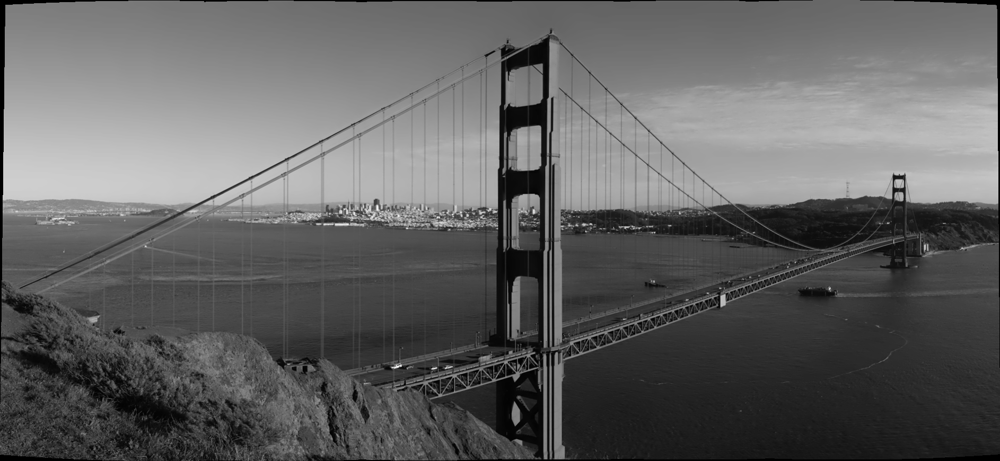
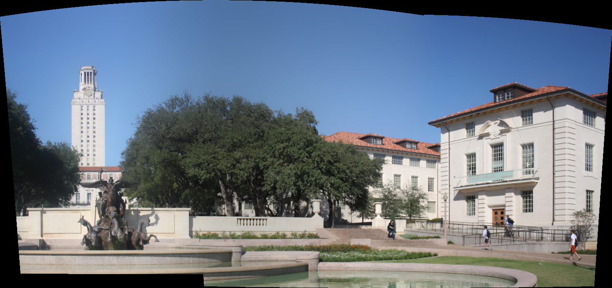

# Panorama Stitching

Project which implements a fully-featured command line program using OpenCV to perform image stitching to create panorama images. Uses two other header-only libraries for parsing command line arguments and for GUI features, such as a file explorer for selecting images, image panorama previewing, and notifications to indicate the status of the program.

## Usage

To run program, ensure OpenCV is installed. Adjust the include path of the makefile if necessary (it probably is), and ensure the other dependencies in the **include** subdirectory are present. To compile:

```
$ make
```

Then simply call:

```
$ ./panorama -h
    or
$ ./panorama --help
```

This will show the help dialog with the available arguments.

```
$ ./panorama -c
    or
$ ./panorama --camera
```

This will use your webcam to feed images into the stitcher. Instructions will display on the preview frame, to capture a frame, press **RETURN**, and to finish capturing frames, press **ESC**

```
$ ./panorama -s
    or
$ ./panorama -select
```

This will bring up a GUI for browsing your system to select images to send to the stitcher. If a panorama can be created, a preview will be display and an dialog giving the option to save the image will appear after the preview is closed.

```
$ ./panorama -i img1.*,img2.*,img3.*,...
    or
$ ./panorama --images=img1.*,img2.*,img3.*,...
```

This is an alternative way to pass images to the program if using the GUI is undesirable or not an option.

```
$ ./panorama -v video.*
    or
$ ./panorama --video=video.*
```

This will allow you to pass a video file, from which frames will be taken at a certain rate, which the default parameter is set to every tenth of the video's total frames, so 10 frames will be used to construct the panorama. For longer videos, this parameter will have to be adjusted in function prototype of videoCapture().

```
$ ./panorama -d [0..10]
    or
$ ./panorama --demo=[0..10]
```

This command allows you to use the demo image datasets, which are enumerated from 0 to 10, inclusive. Simply pass a number in this range to this command to run the stitching algorithm against the dataset. The datasets range in size from 2 - 50+ images.

## Dependencies

- OpenCV
- <a href="https://github.com/jarro2783/cxxopts" target="_blank">cxxopts</a> (included)
- <a href="https://github.com/samhocevar/portable-file-dialogs" target="_blank">portable-file-dialogs</a> (included)

## Results

<div align="center">
    
</div>

<div align="center">
    
</div>

<div align="center">
    
</div>

<div align="center">
    
</div>
